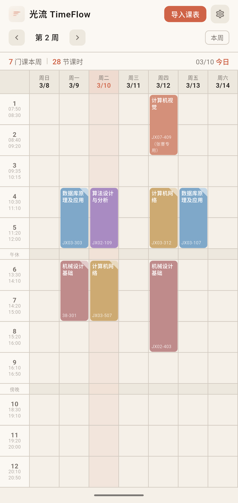
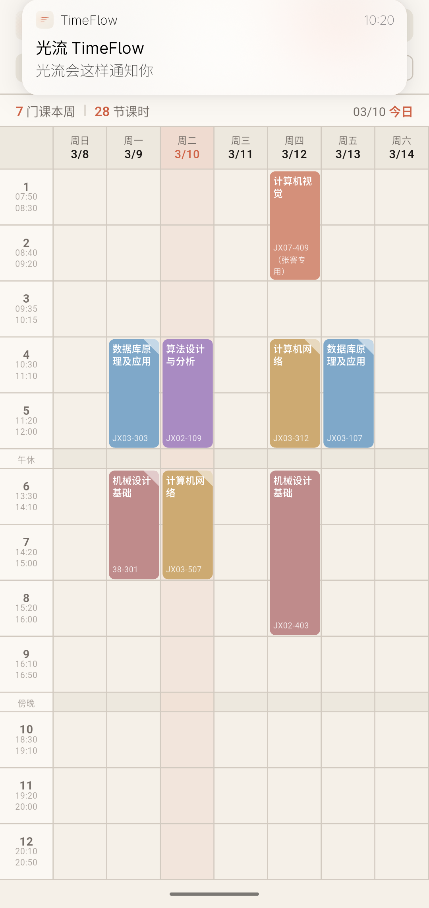
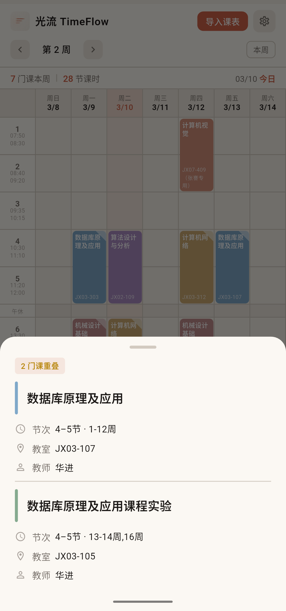
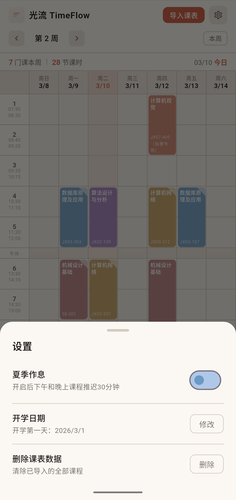
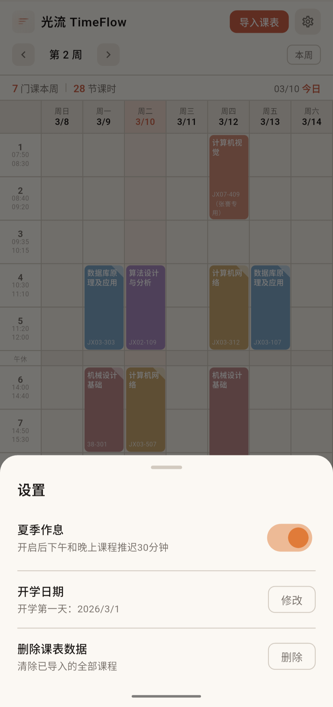
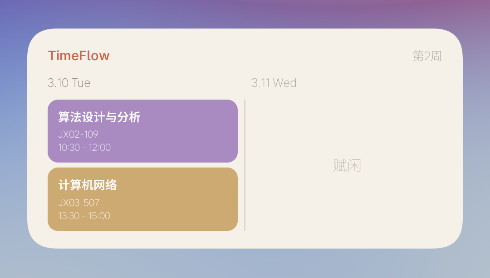

#  TimeFlow 光流

专为南通大学教务系统设计的课程表 App，简洁、精美、无广告，记录你校园时光的流动轨迹。

## ✨特色
- **无需注册**，导入即用
- 数据**本地**存储
- **无广告**
- 桌面小组件
- 上课前30分钟通知
- UI精美，**莫兰迪色系**课程卡片
- **冬夏作息**一键切换

## 📦下载
[安卓 APP](https://github.com/WJSGZZ/TimeFlow/releases/latest)

## 📱界面展示

&nbsp;&nbsp;&nbsp;&nbsp;

&nbsp;&nbsp;&nbsp;&nbsp;

首页 · 通知· 课程重叠

&nbsp;&nbsp;&nbsp;&nbsp;

冬 · 夏

小组件

## 🎨Logo设计
- **三条横线**：这是光掠过时留下的余痕，也是时间流逝时刻下的印记
- **长度递减**：诉说着光流渐弱、韶华渐逝
- **渐变色彩**：光本来的模样——从炽烈到温柔，从满溢到消散
- **极简主义**：留白，是对时间最深的尊重

Logo

## 📄开源说明
本项目采用自定义非商业开源协议，详见 [LICENSE](LICENSE)

- 任何人可以自由使用、修改、分发
- 改编版本必须同样开源
- **不可商用**
- 欢迎适配其他高校教学系统
